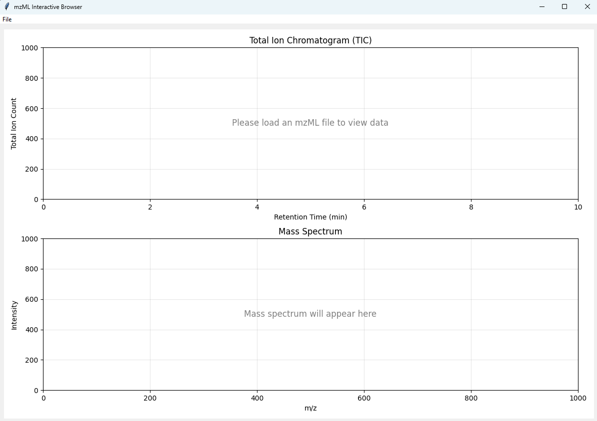
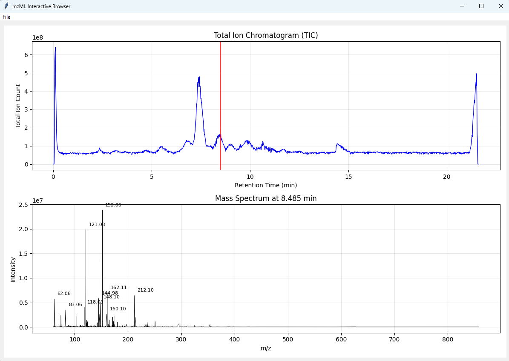

# mzML Interactive Browser

An interactive Python application for visualizing mzML (mass spectrometry) files. Explore total and extracted ion chromatograms, inspect mass spectra at any retention time, and label peaks in the visible m/z range as you zoom.

**Repository:** [github.com/mknierman/mzML-Browser](https://github.com/mknierman/mzML-Browser)

## Requirements

- **Python** 3.8 or newer (tested with Python 3.13)
- **tkinter** — included with most Python installations (see [Troubleshooting](#troubleshooting) if missing)

### Python packages

| Package     | Purpose                          |
|------------|-----------------------------------|
| `pymzml`   | Parse mzML files                  |
| `matplotlib` | Interactive plots and toolbar   |
| `numpy`    | Numerical arrays                  |

Install with:

```bash
pip install -r requirements.txt
```

Verify the installation:

```bash
python tools/test_installation.py
```

## Quick start

```bash
python mzml_browser.py
```

Then use **File → Open mzML file** to load data.





## Features

### Upper plot (chromatogram)

- **TIC (Total Ion Chromatogram)** — total ion count vs retention time.
- **XIC (Extracted Ion Chromatogram)** — ion chromatogram for a target **m/z** ± **ppm** tolerance. Enter values and click **Update XIC**; click **TIC** to switch back.
- **Selection** — red vertical line at the selected retention time. Click the chromatogram to select a scan; use **←** / **→** to step to the previous/next MS1 spectrum.

### Lower plot (mass spectrum)

- Spectrum at the retention time selected in the upper plot.
- **Profile / centroid** — toggle with **Centroid** / **Profile** (line plot vs vertical sticks).
- **Peak labels** — top **N** peaks in the **visible** m/z range, labeled to 4 decimal places. Set **N** in **Peaks to label** and press **Enter**. Labels refresh when you zoom (scroll, drag, or toolbar).

### Navigation bar

| Control | Action |
|--------|--------|
| **HOME** | Reset both plots to full view |
| **Reset MS zoom** | Reset only the mass spectrum to full view |
| **TIC** | Show total ion chromatogram in upper plot |
| **m/z**, **ppm**, **Update XIC** | Show extracted ion chromatogram in upper plot |
| **Centroid** / **Profile** | Toggle mass spectrum display style |
| **Peaks to label** | Number of peak m/z labels in the MS plot (1–100) |

### Mouse and keyboard

| Input | Action |
|-------|--------|
| Click upper plot | Select spectrum at that retention time |
| **←** / **→** | Previous / next MS1 spectrum |
| Scroll wheel on MS plot | Zoom mass spectrum |
| Click and drag on MS plot | Zoom to selected region |
| Matplotlib toolbar | Zoom, pan, and save plots |

### Other

- Loading dialog with progress while a file is opened.
- Status bar shows file name, retention time, and current mode.

## Usage

1. **Run** `python mzml_browser.py`.
2. **Open** an mzML file via **File → Open mzML file**.
3. **Explore the TIC** — click peaks or regions to view mass spectra; use arrow keys to step through scans.
4. **Extract an XIC** — enter **m/z** and **ppm**, then click **Update XIC**.
5. **Inspect mass spectra** — zoom with scroll or drag; adjust **Peaks to label** as needed; toggle profile/centroid.
6. **Reset views** — **HOME** for both plots, **Reset MS zoom** for the mass spectrum only.

## File format support

- Standard mzML files with MS1 spectra, retention time, and m/z/intensity arrays.
- Only **MS1** spectra are loaded and displayed.

## Troubleshooting

| Issue | Suggestion |
|-------|------------|
| **Missing tkinter** | On Linux: `sudo apt install python3-tk` (Debian/Ubuntu) or equivalent for your distro. |
| **Slow loading** | Large files are fully loaded into memory; wait for the progress dialog to finish. |
| **High memory use** | Very large mzML files may require substantial RAM. |
| **No MS1 data** | Ensure the file contains MS1 spectra in valid mzML format. |
| **Import errors** | Run `python tools/test_installation.py` and reinstall with `pip install -r requirements.txt`. |

## Technical details

- **TIC** — built from `spectrum.TIC` for each MS1 scan.
- **XIC** — for each MS1 scan, intensities are summed for peaks within `m/z ± m/z × (ppm / 10⁶)`.
- **Peak labels** — recomputed from peaks in the current MS plot x-axis limits; updated on zoom via scroll, drag, and axis limit changes.
- **Data access** — spectra use pymzml `spectrum.mz` and `spectrum.i` (pymzml 2.5.x).
- **GUI** — tkinter + matplotlib (`FigureCanvasTkAgg`, `NavigationToolbar2Tk`).

## Project files

| File | Description |
|------|-------------|
| `mzml_browser.py` | Main application |
| `requirements.txt` | Python package dependencies |
| `tools/test_installation.py` | Check that dependencies and GUI backend work |
| `tools/debug_pymzml.py` | Optional pymzml API debugging helper |
| `images/` | Screenshots for documentation |

## Example workflow

1. Start the app and open an mzML file.
2. Review the TIC; optionally extract an XIC for a compound of interest.
3. Click or use arrows to move to a retention time of interest.
4. Zoom the mass spectrum; peak labels update to the top N peaks in view.
5. Toggle profile/centroid and adjust **Peaks to label** as needed.
6. Use **HOME** or **Reset MS zoom** to return to full view.

## License

This project is open source and available under the [MIT License](LICENSE).

## Notes

Developed with assistance from [Cursor](https://cursor.com).
